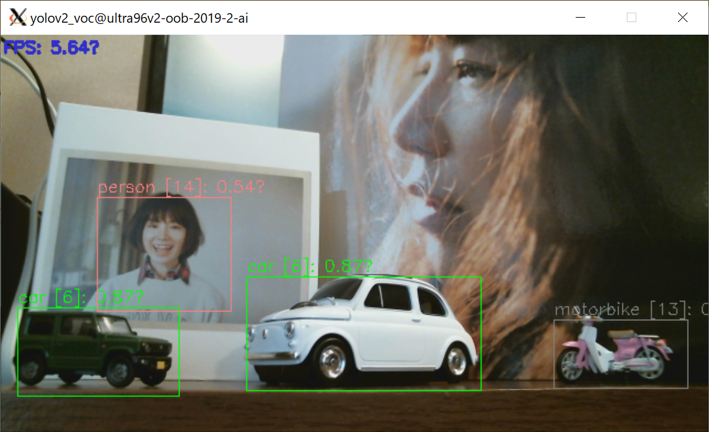
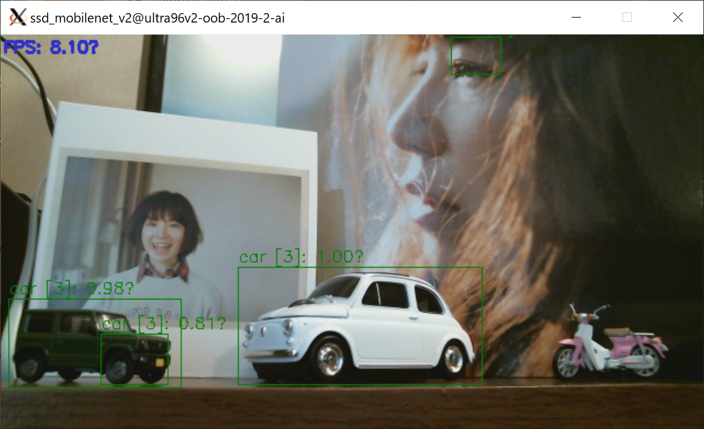

# Vitis AI Library Applications

Vitis AI Libraryを使用したアプリケーションを作成、動作確認する。  
ハードウェア環境の構築などは以下を参照。

* [DNNDK on Vitis AI on Ultra96v2](https://qiita.com/nv-h/items/7525c9319087a3f51755)
* [Vitis AI Library on Ultra96v2](https://qiita.com/nv-h/items/8f3b05e4e47928718992)

# Usage

Xilinxが用意しているデモ

```sh
video_demo_app <model_name> <video_num> [-t <thread_num>]
```

シングルスレッド

```sh
video_single_th_app <model_name> <video_num>
```

* `model_name` : 使用できるモデルは、`/usr/share/vitis_ai_library/models`にあるものだけと思われる。現状、以下に対応。  
    + Yolo v2: `yolov2_voc` `yolov2_voc_pruned_0_66` `yolov2_voc_pruned_0_71` `yolov2_voc_pruned_0_77`
    + Yolo v3: `yolov3_adas_pruned_0_9` `yolov3_bdd` `yolov3_voc` `yolov3_voc_tf`
    + SSD Caffe:`ssd_adas_pruned_0_95` `ssd_mobilenet_v2` `ssd_pedestrain_pruned_0_97` `ssd_traffic_pruned_0_9`
    + SSD Tensorflow:`ssd_mobilenet_v1_coco_tf` `ssd_mobilenet_v2_coco_tf` `ssd_resnet_50_fpn_coco_tf`
* `video_num` : Integer (X of `/dev/videoX`)
* `thread_num` : Xilinxが用意しているデモライブラリでのスレッド指定。DPUとのデータのやり取りが高速になる。

動作イメージ


# Performance (fps) on ultra96v2

Using USB Web Camera C615 @640*360 (X forwarding).
fpsは小数点以下切り捨てで測定した。同一条件でもけっこうばらつきがあると思われる。


## video_demo_app using `vitis::ai::main_for_video_demo()`

ultra96v2ではDPUが一つしか実装できないのでDPUで律速になるような、重いモデルではマルチスレッドがほとんど効果がない。

|            model             | -t 1 | -t 2 | -t 4 |
|------------------------------|------|------|------|
| `yolov2_voc`                 |    8 |    9 |    9 |
| `yolov2_voc_pruned_0_66`     |   21 |   23 |   24 |
| `yolov2_voc_pruned_0_71`     |   24 |   26 |   28 |
| `yolov2_voc_pruned_0_77`     |   27 |   28 |   29 |
| `yolov3_adas_pruned_0_9`     |   11 |   11 |   12 |
| `yolov3_bdd`                 |    4 |    5 |    5 |
| `yolov3_voc`                 |    5 |    5 |    5 |
| `yolov3_voc_tf`              |    5 |    5 |    5 |
| `ssd_adas_pruned_0_95`       |   29 |   29 |   30 |
| `ssd_mobilenet_v2`           |   10 |   10 |   10 |
| `ssd_pedestrain_pruned_0_97` |   30 |   30 |   30 |
| `ssd_traffic_pruned_0_9`     |   20 |   27 |   27 |
| `ssd_mobilenet_v1_coco_tf`   |   21 |   21 |   22 |
| `ssd_mobilenet_v2_coco_tf`   |   20 |   21 |   22 |
| `ssd_resnet_50_fpn_coco_tf`  |    0 |    0 |    1 |

## video_single_th_app

|            model             |    |
|------------------------------|----|
| `yolov2_voc`                 |  5 |
| `yolov2_voc_pruned_0_66`     |  9 |
| `yolov2_voc_pruned_0_71`     |  9 |
| `yolov2_voc_pruned_0_77`     |  9 |
| `yolov3_adas_pruned_0_9`     | 10 |
| `yolov3_bdd`                 |  3 |
| `yolov3_voc`                 |  3 |
| `yolov3_voc_tf`              |  3 |
| `ssd_adas_pruned_0_95`       | 12 |
| `ssd_mobilenet_v2`           |  7 |
| `ssd_pedestrain_pruned_0_97` | 13 |
| `ssd_traffic_pruned_0_9`     | 10 |
| `ssd_mobilenet_v1_coco_tf`   | 12 |
| `ssd_mobilenet_v2_coco_tf`   | 11 |
| `ssd_resnet_50_fpn_coco_tf`  |  0 |

# Demo pictures

yolov3_voc


yolov2_voc


ssd_mobilenet_v2


ssd_mobilenet_v2_coco_tf
